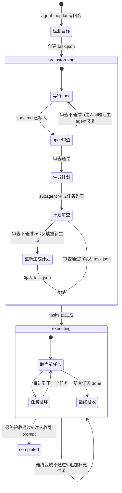
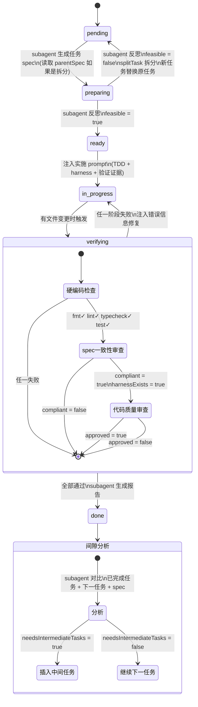
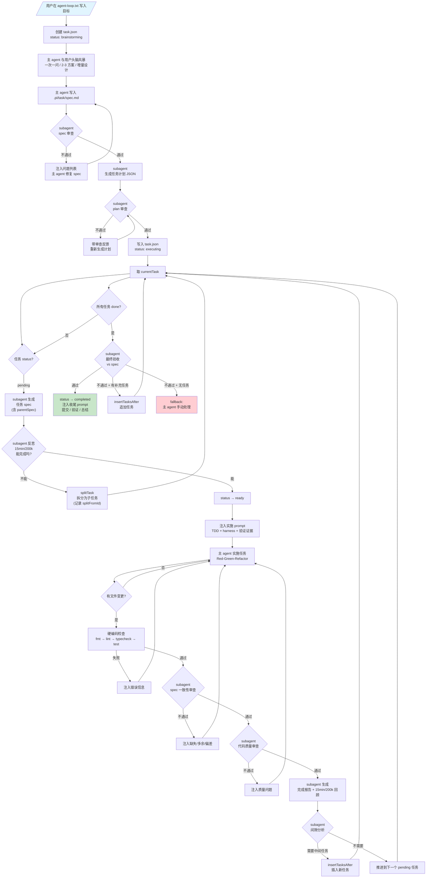
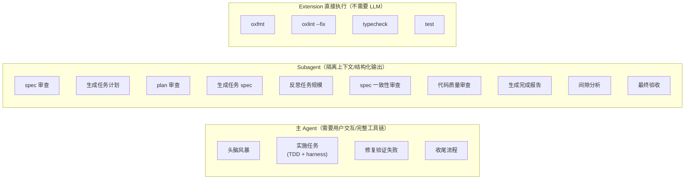

# Task Loop 执行流程

基于 `task-loop.ts` 的实际代码生成。

## 项目级别状态机

```mermaid
stateDiagram-v2
    [*] --> 检测目标: agent-loop.txt 有内容

    检测目标 --> brainstorming: 创建 task.json

    state brainstorming {
        [*] --> 等待spec
        等待spec --> spec审查: spec.md 已写入
        spec审查 --> 等待spec: 审查不通过\n注入问题让主agent修复
        spec审查 --> 生成计划: 审查通过
        生成计划 --> 计划审查: subagent 生成任务列表
        计划审查 --> 重新生成计划: 审查不通过\n带反馈重新生成
        重新生成计划 --> [*]: 写入 task.json
        计划审查 --> [*]: 审查通过\n写入 task.json
    }

    brainstorming --> executing: tasks 已生成

    state executing {
        [*] --> 取当前任务
        取当前任务 --> 任务循环
        任务循环 --> 取当前任务: 推进到下一个任务
        取当前任务 --> 最终验收: 所有任务 done
    }

    executing --> completed: 最终验收通过\n注入收尾 prompt
    executing --> executing: 最终验收不通过\n追加补充任务
```

## 任务级别状态机（任务循环内部）

```mermaid
stateDiagram-v2
    [*] --> pending

    pending --> preparing: subagent 生成任务 spec\n(读取 parentSpec 如果是拆分)

    preparing --> ready: subagent 反思\nfeasible = true
    preparing --> pending: subagent 反思\nfeasible = false\nsplitTask 拆分\n新任务替换原任务

    ready --> in_progress: 注入实施 prompt\n(TDD + harness + 验证证据)

    in_progress --> verifying: 有文件变更时触发

    state verifying {
        [*] --> 硬编码检查
        硬编码检查 --> spec一致性审查: fmt✓ lint✓ typecheck✓ test✓
        硬编码检查 --> [*]: 任一失败
        spec一致性审查 --> 代码质量审查: compliant = true\nharnessExists = true
        spec一致性审查 --> [*]: compliant = false
        代码质量审查 --> [*]: approved = true
        代码质量审查 --> [*]: approved = false
    }

    verifying --> in_progress: 任一阶段失败\n注入错误信息修复
    verifying --> done: 全部通过\nsubagent 生成报告

    done --> 间隙分析

    state 间隙分析 {
        [*] --> 分析: subagent 对比\n已完成任务 + 下一任务 + spec
        分析 --> 插入中间任务: needsIntermediateTasks = true
        分析 --> 继续下一任务: needsIntermediateTasks = false
    }
```

## 完整端到端流程（线性视角）

```mermaid
flowchart TD
    A[/"用户在 agent-loop.txt 写入目标"/] --> B["创建 task.json\nstatus: brainstorming"]
    B --> C["主 agent 与用户头脑风暴\n一次一问 / 2-3 方案 / 增量设计"]
    C --> D["主 agent 写入 .pi/task/spec.md"]
    D --> E{"subagent\nspec 审查"}
    E -->|不通过| F["注入问题列表\n主 agent 修复 spec"] --> D
    E -->|通过| G["subagent\n生成任务计划 JSON"]
    G --> H{"subagent\nplan 审查"}
    H -->|不通过| I["带审查反馈\n重新生成计划"] --> H
    H -->|通过| J["写入 task.json\nstatus: executing"]

    J --> K["取 currentTask"]
    K --> L{"任务 status?"}

    L -->|pending| M["subagent 生成\n任务 spec\n(含 parentSpec)"]
    M --> N{"subagent 反思\n15min/200k\n能完成吗?"}
    N -->|不能| O["splitTask\n拆分为子任务\n(记录 splitFromId)"] --> K
    N -->|能| P["status → ready"]

    P --> Q["注入实施 prompt\nTDD + harness + 验证证据"]
    Q --> R["主 agent 实施任务\nRed-Green-Refactor"]
    R --> S{"有文件变更?"}
    S -->|否| R
    S -->|是| T["硬编码检查\nfmt → lint → typecheck → test"]
    T -->|失败| U["注入错误信息"] --> R
    T -->|通过| V{"subagent\nspec 一致性审查"}
    V -->|不通过| W["注入缺失/多余/偏差"] --> R
    V -->|通过| X{"subagent\n代码质量审查"}
    X -->|不通过| Y["注入质量问题"] --> R
    X -->|通过| Z["subagent 生成\n完成报告 + 15min/200k 回顾"]

    Z --> AA{"subagent\n间隙分析"}
    AA -->|需要中间任务| AB["insertTasksAfter\n插入新任务"] --> K
    AA -->|不需要| AC["推进到下一个 pending 任务"] --> K

    K --> AD{"所有任务 done?"}
    AD -->|否| L
    AD -->|是| AE{"subagent\n最终验收\nvs spec"}
    AE -->|通过| AF["status → completed\n注入收尾 prompt\n提交 / 验证 / 总结"]
    AE -->|不通过 + 有补充任务| AG["insertTasksAfter\n追加任务"] --> K
    AE -->|不通过 + 无任务| AH["fallback:\n主 agent 手动处理"]

    style A fill:#e1f5fe
    style AF fill:#c8e6c9
    style AH fill:#ffcdd2
```

## 执行方式标注

```mermaid
flowchart LR
    subgraph 主agent ["主 Agent（需要用户交互/完整工具链）"]
        direction TB
        MA1["头脑风暴"]
        MA2["实施任务\n(TDD + harness)"]
        MA3["修复验证失败"]
        MA4["收尾流程"]
    end

    subgraph subagent ["Subagent（隔离上下文/结构化输出）"]
        direction TB
        SA1["spec 审查"]
        SA2["生成任务计划"]
        SA3["plan 审查"]
        SA4["生成任务 spec"]
        SA5["反思任务规模"]
        SA6["spec 一致性审查"]
        SA7["代码质量审查"]
        SA8["生成完成报告"]
        SA9["间隙分析"]
        SA10["最终验收"]
    end

    subgraph extension ["Extension 直接执行（不需要 LLM）"]
        direction TB
        EX1["oxfmt"]
        EX2["oxlint --fix"]
        EX3["typecheck"]
        EX4["test"]
    end
```
